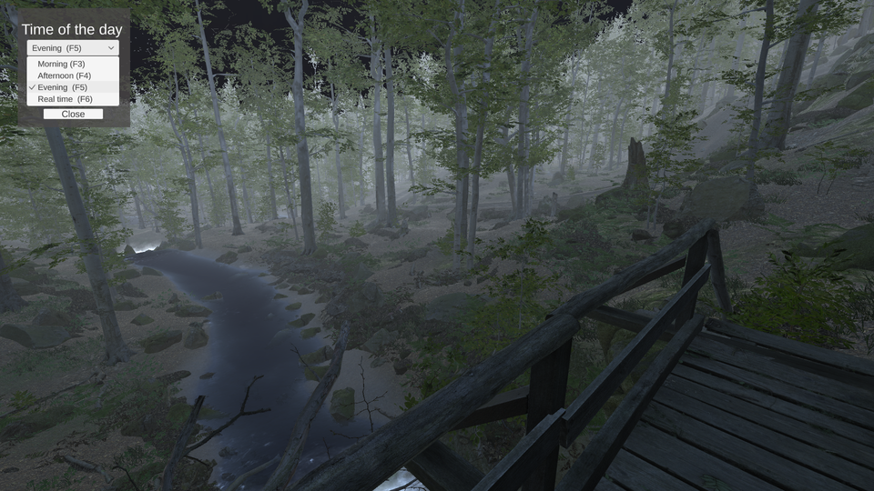

# Unity 3D / C# / Visual Studio - Original game development - 'A Forest'

*November / December 2019 - Development time: 3 weeks*

> 🔨 Game made with Unity 3D (ver. 2019.2.4f1). In this game you walk in a forest and you decided to clean the rubbish to preserve nature. So pick up all the soda  cans in the allotted time.
 It's an original game, not inspired by a tutorial. By the way I used tons of tutorials and websites to help during the development.
 The gameplay is quite basic, but the mecanics including navigation, introduction, sound design are the same than in a commercial game. The 3D environments and animations are quite high grade quality.

* * *

## 1. Installation

### 1.1 Windows x86_64

#### 1.1.1 Windows Installer

Download the installer [here](https://drive.google.com/open?id=1ge26sNREoVhetAXvAMiVUBR2xhc7l5BA) [899Mb] and just follow the instructions.

#### 1.1.2 Zip version

Download the zip with the game [here](https://drive.google.com/open?id=132E5ejLU5oWoKGphxwqQsrJybRMVBZgi) [0.98Gb] and unzip forest-windows64.zip on your computer.

In 'forest-windows64' launch forest-project.exe by clicking on it to play.

### 1.2 Mac OSX

Download the zip with the game [here](https://drive.google.com/open?id=1z-Ep5Kwq5RcbGIM-JlVLDDj9Zol4g6vG) [1.00Gb] and unzip forest-mac-osx.zip on your computer.

In 'forest-mac-osx' launch build-macsos.app by clicking on it to play.

### 1.3 Linux x86_64

Download the zip with the game [here](https://drive.google.com/open?id=14qKlgEXHS3Ig2xN-HV_RVtu_QQQz54Pt) [1.01Gb] and unzip build-linux_x86_64.zip on your computer.

In 'build-linux_x86_64' launch forest-project.x86_64 (you will have to allow the file running as executable: right click on forest-project.x86_64 and chose Properties -> Permissions -> Allow executing file as program).

Or in the directory 'build-linux_x86_64':

~~~~
chmod +x forest-project.x86_64
run forest-project.x86_64
~~~~

### 1.4 Scripts for reviewing

Scripts used are in the [script folder](https://github.com/Raigyo/unity-3d-game-forest/tree/master/scripts) on this repository.

*-------*

## 2. About

This game was made to show my skills using Unity 3D and what's it's possible to do with it. This game has a peaceful atmosphere and educational virtues. It's usually the kind of game / application that inspires institutionnal or non-profit organizations as clients.

It's a desktop version. It would be possible to make that kind of game for mobiles or web browsers (WegGL), but the quality should be downgraded.

This game has been tested again and again and again... But if you have advises or if you see bugs / problems, please contact me using the issue button on this repository.

### 2.1. How to play

#### 2.1.1. Playing game (Game mode)

Walk in the forest and grap the 30 cans within 10 minutes.

Use **wasd** or **zqsd** keys (according to your choice in the menu setting) to move and your mouse to look around. Use **LeftShift** to run and **Space** to jump.
You can help yoursel with the minimap that displays can that are near you.

If you win or fail, a menu is displayed asking you if you want to try again or go back to menu.

Other features:

- 'F2': show / hide the Minimap

- 'Escape' / 'P': show / hide pause menu with continue or back to menu.

#### 2.1.2. Walking mode (Free mode)

No cans to pickup or timer, just walk and discover the landscape using the same keys than in game mode.

- 'F2': Open the pannel to choose and display the time of the day, it will affect the environment lighting. Or choose the time of the day with 'F3' / 'F4' / 'F5'/ 'F6' (simulated morning / afternoon / evening or real time).

- 'Escape' / 'P': show / hide pause menu with continue or back to menu.

#### 2.1.3. Settings

Here you can change the keyboard layout setting, querty (WASD) or azerty (ZQSD). You could also see a summary of the keys used in the game.

*-------*

## 3. Techniques / Assets / Scripts

### 3.1. Intro scene (scene name: intro)

#### 3.1.1. Menu

You can select between game mode or walking mode.

The game selected is managed by Scriptable Objects (that can be sused as 'global' variables between scenes).

The two versions of the game a just one scene with some GameObjects displayed or not according to the boolean value in the Scriptable Objects. This value is reset each time we comme back to the ontro scene.

#### 3.1.2. Settings

Here you can choose keyboard layout.

It's a native feature that lacks in Unity for years. That's wy I use the asset [Rewired](https://assetstore.unity.com/packages/tools/utilities/rewired-21676) that is more powerful thant the input management of Unity, even the new one in preview.

It uses scriptable objects to remember the choice in the second scene.

#### 3.1.3. Cinematic

This scene has been made using the Unity additionnal package [Cinemachine](https://unity.com/fr/unity/features/editor/art-and-design/cinemachine).

Cinemachine allows to use several virtual cameras to make cut-scenes, trailers and so on. In this intro I use the 'dolly track' feature.

The lanscape is the same the the one used in the game. The result is displayed as an animation made with the components *Animator* and *Animation*.

To make quality cinematics can be a long process... Here it's far to be perfect, you could see some speed variation during the cinematic...

#### 3.1.4. Canvas

Canvas are used as overlay to display buttons and informations (GUI), with some scripting and EventSystem components, including tooltips.

There are also many canvas in the forest/game scene. I used 'scale with screen size' rendering and anchors' to be sure that every elements fit on the screen according to the resolution. Several resolutions have been tested in the game pannel using the resolutions / aspect ratio selector.

#### 3.1.5. Loader

The music is fade out with a coroutine then another coroutine is launched to display the loader asynchronously. The same loader is used on the two scenes. There aren't specic script for this scene, it uses the same than in the next so they will be detailled there.

### 3.2. Game scene (scene name: forest)

#### 3.2.1. The terrain

This game uses [Forest Environment - Dynamic Nature](https://assetstore.unity.com/packages/3d/vegetation/forest-environment-dynamic-nature-150668) from [NatureManufacture](https://assetstore.unity.com/publishers/6887).

And yes, it uses the demo provided with the asset. To speak franckly, this game is just for demonstration purpose. To make that kind of map takes about two weeks for a professionnal level designer (according to NatureManufacture). Moreover, everything already uses LOD (Level of Detail according the position of the camera), that increases performances.

BTW I've used the new Terrain Tools package (preview) to make some changes in the terrain. You should not be able able to fall from it now...

The terrain is surrounded by moutain and there is a slope detection to avoid player falling outside the map.

By the way, I made like all developers, I added... invisible walls! (just in case).

#### 3.2.2. Minimap

The game use a minimap in the GTA style to display the rubbish to collect. The minimap is made with a ortographic camera above the player.

In the properties of this camera I target a render texture previously made. So I can use this texture in the overlay in a raw image with the content displayed with the camera in it as texture.

To improve performances, this camera uses occlusion culling (so what is not in front of the camera is not calculated by the computer) and displays some layers only in culling mask.

Markers are GameObjects in the prefab of cans. The main camera displays the layer with the rubbish and the minimap only these markers.

#### 3.2.3. Script: [HitBehaviour.cs](scripts/HitBehaviour.cs)

//HitBehaviour: Raycast on GO that can be picked-up / Highlight GO

Script that uses raycast to find if we hit an object on the 'rubbish' layer (cans). It calls an other script when we click on an grabbable object.

It's also used to change the material on grabble object when the raycast hits it.

It's also in this script that I cound the cans grabbed. I can define if all the cans have been picked up. It could be managed in another script, but It was  the easiest way for me to avoid to increase the score if the player would click several times... The rubbish are children of a GameObject (used like a kind of folder). I don't have to specify how many GO there are in it because I count them in the script. BTW It's divided by 2 because each prefab has two GO, the rubbish and its icon (for the minimap)...

#### 3.2.4. Script: [GrabObject.cs](scripts/GrabObject.cs)

// GrabObject: animation / sound / set the object unactive

Script used to grap the object following a guide put on the FPSPlayer component.

When the mouse button is released the script set inactive the icon on minimap immediately (otherwise it moves on the minimap following the can asset). The can disapear after a few time using a coroutine and the IEnumerator method.

It's also in that script that the sound is played.

#### 3.2.5. Script: [ScoreAndTimeController.cs](scripts/ScoreAndTimeController.cs)

//ScoreAndTimeController : counter and score management / detect if lost or win**

Coundown that converts deltaTime in minutes / seconds. Delta time can be specified in the inspector.

Score displaying according to the total of GO contained in the rubbish GO.

It's also that calss that controls if the player has won or lost.

#### 3.2.6. Script: [GameController.cs](scripts/GameController.cs)

//GameController : counter and score management / display messages and pannels /show hide some elements

This script manage many things: display or hide elements according to the situation.

- Manage GUI buttons on intro
- Displays elements that are Game mode / Free mode specific
- Displays pannels and messages when we lost or win
- Manage loading scene and progress bar for the two scenes
- Manage the launch of sound fade in / fade out

Note to myself: don't forget 'Event Listener' if you use GUI.

#### 3.2.7. Script: [FirstPersonControllerEdited.cs](scripts/FirstPersonControllerEdited.cs)

//FirstPersonController.cs: Player control management

Modified version of **FirstPersonController.cs** component to manage **Rewired** and **Dynamic Footsteps for first person games** assets and **SlopeDetection.cs** datas.

#### 3.2.8. Script: [ActionKeysManager.cs](scripts/ActionKeysManager.cs)

//ActionKeysManager: Manages the keyboard shortcuts ingame and what's displayed / hidden then**

Used for the pause menu, the displaying of the minimap or the time selector pannel.

It also display a pannel in walking mode that allows to choose the time of the day and display the hour using dropdown menu and toggle.

#### 3.2.9. Script: [SlopeDetection.cs](scripts/SlopeDetection.cs)

//SlopeDetection: Finds the slope/grade/incline angle of ground underneath a CharacterController**

I used and modified this [script](https://gist.github.com/jawinn/f466b237c0cdc5f92d96) to detect the slope using a raycast behind the player. so i can set the high of jump according to the slope/ incline angle of ground underneath.

#### 3.2.10. [ToolTips.cs](scripts/ToolTips.cs)

//ToolTips: displays tooltip on menu when a button is hovered**

Script to display tooltips. The content (title+content) is managed in a component on the GO.

#### 3.2.11. Footstep sounds

I use the asset [Dynamic Footsteps for first person games](https://assetstore.unity.com/packages/tools/dynamic-footsteps-for-first-person-games-85052) to manage footstep sounds. Not expensive and very useful.

With that asset you can define sounds played randomly using a tag. BTW I had to adjust or create some colliders (primitive / mesh) on some GameObjects (water and bridges). According to me it's more easy to add colliders on a tagged GO than define texture that will interact with a raycast  (textures can be numerous or be changed by the designer / raycast could... not work on every cases) . I've tried several solutions, this one convinced me.

#### 3.2.12. Time of the day

During the game, the time goes by...

I use the following asset for that: [Hendrik Haupt - Enviro - Sky and Weather](https://assetstore.unity.com/packages/tools/particles-effects/enviro-sky-and-weather-33963)

Note to myself: uncheck 'don't destroy on load' on Enviro manager to reset all datas and reactivate them by scripting.

### 3.3. Optimization

Scripts avoid to use *GameObject.FindGameObjectsWithTag* or *GameObject.Find* methods but use public variables that can be accessed from the inspector.

TextMeshPro is used for text that's more efficient than regular text.

There is occlusion culling (the computer calculate only what's shown by the camera) on the cameras using the rendering option (not on the camera component otherwise it causes glitches).

A lot of asset in hierarchy use LOD (Level of Detail) that *reduces the load on the hardware and improves the rendering performance*.

All the cameras allow **dynamic resolution**. It means that if frame rate reduces, the game scales down the resolution to maintain a consistent frame rate.

### 3.4. Sound design

Excepted in the profesionnal gaming industry, I've noticed that the sound design is often neglected.

However, it's very important in what you feel when you play game, watch movies, series and so on... Like in the real life, real silence is quite rare... The sound and music, it's 90% of the atmosphere... So I've paid attention of the sound in this game.

So I've bought some royalty free soundtracks and also took care of licensing so I selected royalty free ones.

This royalty free song from [Whitesand](https://www.youtube.com/watch?v=_hSyRMyqFOM) is used for the intro.

*-------*

## 4. Credits

### 4.1. Music & Sounds

- Whitesand - Drops (Royalty and Copyright Free) - [Youtube](https://www.youtube.com/watch?v=_hSyRMyqFOM) / [Facebook](https://www.facebook.com/martynlaur) / [Twitter](https://twitter.com/MartynLaur) / [Instagram](https://www.instagram.com/martynas_lau/) / [SoundCloud](https://soundcloud.com/martynaslau)
- Forest Sounds Germany ! Crows, Birds & Soft Wind! Royalty Free - [freetousesounds](https://freetousesounds.bandcamp.com/track/forest-sounds-germany-crows-birds-soft-wind-royalty-free)
- Night Sounds National Park Doi Suthep, Thailand! Jungle Sound Effects! Royalty Free - [freetousesounds](https://freetousesounds.bandcamp.com/album/night-sounds-national-park-doi-suthep-thailand-jungle-sound-effects)
- [Free SFX / Free Sound Effects](https://www.freesfx.co.uk/Default.aspx)
- [Zapsplat / Free sound effects & royalty free music](https://www.zapsplat.com/)
- [Freesound](https://freesound.org/)

### 4.2. Assets used

- [3D Game Kit - Unity Technologies](https://assetstore.unity.com/packages/templates/tutorials/3d-game-kit-115747)
- [Bird Flock Bundle - Unluck Software](https://assetstore.unity.com/packages/3d/characters/animals/bird-flock-bundle-25576)
- [Cola Can - YGS Assets](https://assetstore.unity.com/packages/3d/cola-can-96659)
- [Dynamic Footsteps for first person games - John's Art](https://assetstore.unity.com/packages/tools/dynamic-footsteps-for-first-person-games-85052)
- [Enviro - Sky and Weather - Hendrik Haupt](https://assetstore.unity.com/packages/tools/particles-effects/enviro-sky-and-weather-33963)
- [Firefly Particles - Unluck Software](https://assetstore.unity.com/packages/vfx/particles/environment/firefly-particles-89299)
- [Forest Environment - Dynamic Nature - NatureManufacture](https://assetstore.unity.com/packages/3d/vegetation/forest-environment-dynamic-nature-150668)
- [Rewired - Guavaman Enterprises](https://assetstore.unity.com/packages/tools/utilities/rewired-21676)

### 4.3. Fonts

- [FontSpace - Font Curiosity](https://www.fontspace.com/)

### 4.4. Softwares

- [Audacity](https://www.audacityteam.org/)
- [Inno Setup - Installer](http://www.jrsoftware.org/isinfo.php)

*-------*

## 5. Useful links & Greetings

- [Brackeys Game Dev Tutorials](https://www.youtube.com/channel/UCYbK_tjZ2OrIZFBvU6CCMiA)
- [DitzelGames](https://www.youtube.com/channel/UCdedu-nAwMACE5WbVcmp3Bg)
- [Epitome](https://www.youtube.com/channel/UCsaXQNLxeHvwJdDUrICGufA)
- [IMERSITY](https://www.youtube.com/channel/UCCCf8Z1iY3yXQUxcnarA0Ag)
- [Info Gamer](https://www.youtube.com/channel/UCyoayn_uVt2I55ZCUuBVRcQ)
- [inScope Studios](https://www.youtube.com/channel/UCyVsCcTte38YC9CxJtw3hBQ)
- [Jason Weimann - Unity 3D College](https://www.youtube.com/channel/UCX_b3NNQN5bzExm-22-NVVg)
- [Learn Everything Fast](https://www.youtube.com/channel/UCG5XadFg6icC2TcF0I5DIig)
- [Raywenderlich](https://www.raywenderlich.com/)
- [SpeedTutor](https://www.youtube.com/channel/UCwYuQIa9lgjvDiZryUVtFGw)
- [Sylvain - Créateur 3D](https://www.youtube.com/channel/UC8BM2xQlXcK4Vt3OqfOmj9g)
- [TUTO UNITY FR](https://www.youtube.com/channel/UCJRwb5W4ZzG43J5_dViL6Fw)
- [Unity Guruz](https://www.youtube.com/channel/UCgd3l8iA5zBYVa4sQ6-ONFw)
- [Unity Learn](https://learn.unity.com/)
- [Unity Pour les nuls](https://www.youtube.com/channel/UCuU8cONIgZ182KheI1s6HqQ)
- [Unity3D With Scott](https://www.youtube.com/channel/UC9hfBvn17qSIrdFwAk56oZg)

*-------*

## 6. Contact (Github / Linked In)

- [My Github](https://github.com/Raigyo)
- [My LinkedIn](https://www.linkedin.com/in/vincent-chilot/)

